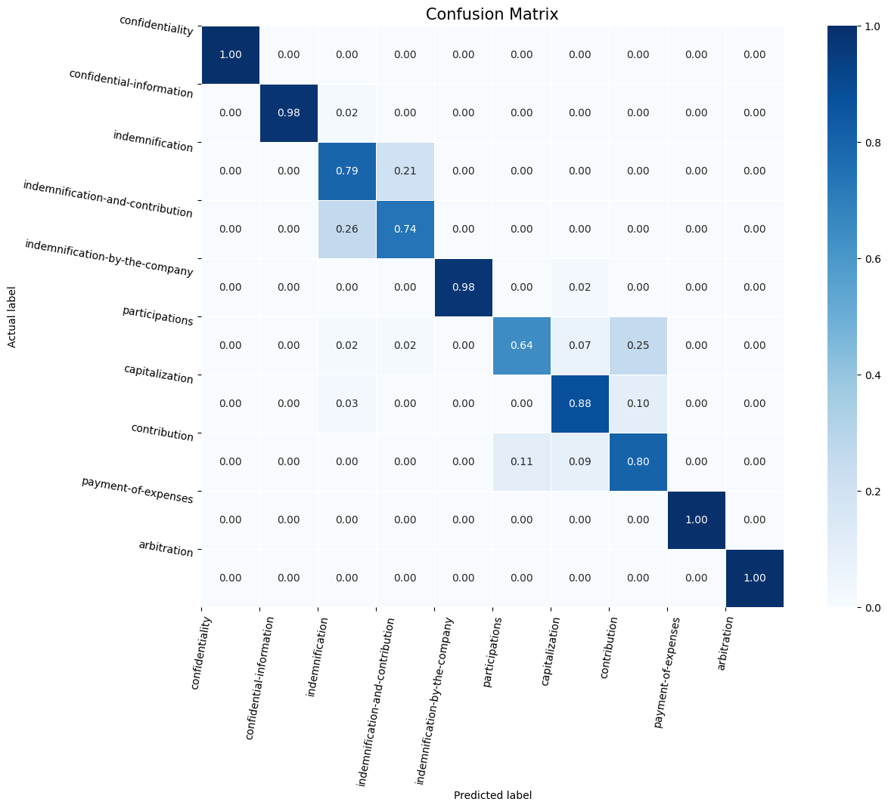

# Clause Classification Project

## NON-TECHNICAL EXPLANATION
The purpose of this project was to experiment with different models and types of text encoding  for text classification in the legal context. 
This was trained and tested on a ten clause subset of a kaggle dataset The project considered three different models:
* [K-Nearest Neighbour](https://scikit-learn.org/dev/modules/generated/sklearn.neighbors.KNeighborsClassifier.html) using [TFID Vectorizer](https://scikit-learn.org/stable/modules/generated/sklearn.feature_extraction.text.TfidfVectorizer.html)
* [Decision Tree](https://scikit-learn.org/stable/modules/generated/sklearn.tree.DecisionTreeClassifier.html) and [Random Forest](https://scikit-learn.org/stable/modules/generated/sklearn.ensemble.RandomForestClassifier.html#sklearn.ensemble.RandomForestClassifier) using [Doc2Vec](https://radimrehurek.com/gensim/auto_examples/tutorials/run_doc2vec_lee.html)
* [Simple Multi-Layer Perceptron (MLP)](http://neuralnetworksanddeeplearning.com/chap1.html) built in [Tensorflow Keras](https://www.tensorflow.org/guide/keras) using [TFID Vectorizer](https://scikit-learn.org/stable/modules/generated/sklearn.feature_extraction.text.TfidfVectorizer.html)

In each case the model was trained using k-folds validation and I used [the Optuna Library](https://optuna.org/) for hyperparameter optimisation.
The goal of the model was to obtain the highest level of accuracy in classifying an unseen set of clauses to the correct classification.  
The most successful model was a simple two layer perceptron which achieved 88% accuracy, given the relatively small dataset this was a good result. With more time I would like to have experimented further with different combinations of text preprocessing steps, methods of vectorisation and models.
Primarily this project was a learning exercise and should be treated as such.
## DATA
There is a data sheet below.  In summary, the data was from a kaggle data set to be found [here](https://www.kaggle.com/datasets/bahushruth/legalclausedataset).
To limit processing time I filtered this dataset by picking the ten clause types with the highest number of examples.  This summary demonstrates two challenges in the data set: 
<ol>1. There are closely related clause types.  For example; indemnification-and-contribution,  indemnification, and indemnification-by-the-company.  
2. Some of the records have clause types with very few words in them - sometimes less than ten.   
3. There is a relatively small number of total records, 2150, spread over a relatively large range of categories. </ol>
This relative scarcity of data and the close inter-relations of some of the categories makes this quite a challenging categorisation project.  

| Label                           | Record Count | Min Word Count | Max Word Count | Avg Word Count |
|---------------------------------|--------------|----------------|----------------|----------------|
| indemnification-and-contribution | 180          | 5              | 415            | 303            |
| indemnification                 | 210          | 4              | 418            | 247            |
| confidentiality                  | 220          | 6              | 416            | 242            |
| indemnification-by-the-company   | 230          | 4              | 430            | 218            |
| contribution                     | 180          | 50             | 424            | 327            |
| participations                   | 210          | 29             | 428            | 253            |
| arbitration                      | 240          | 2              | 408            | 212            |
| confidential-information         | 240          | 3              | 410            | 195            |
| capitalization                   | 200          | 13             | 422            | 275            |
| payment-of-expenses              | 240          | 5              | 412            | 200            |
Word counts are prior to text pre-processing.
The text of the clauses was preprocessed to:
* Remove the Clause title (Label) from the main body of the clause
* Removing special characters, low casing, removing punctuation, lemmatization and removing stop words.  This was done using the [Gensim Library](https://radimrehurek.com/gensim/parsing/preprocessing.html).
The data was then shuffled and split into Train and Test sets.  The same train (75%) and test sets (25%) were used by each model to avoid any unintentional bias.  
For the MLP labels were converted to integers. 

## MODEL 
I selected three Classifier models with increasing levels of complexity.  The goal was to understand what benefits were gained at increasing levels of complexity and computing resource.  In the case of Decision Trees when it became clear that the model was suffering from overfitting, I also ran a Random Forest Classifier which improved the results.
* Simple Model -  [K-Nearest Neighbour](https://scikit-learn.org/dev/modules/generated/sklearn.neighbors.KNeighborsClassifier.html) using [TFID Vectorizer](https://scikit-learn.org/stable/modules/generated/sklearn.feature_extraction.text.TfidfVectorizer.html)
* More complex with different vectorisation - [Decision Tree](https://scikit-learn.org/stable/modules/generated/sklearn.tree.DecisionTreeClassifier.html) and [Random Forest](https://scikit-learn.org/stable/modules/generated/sklearn.ensemble.RandomForestClassifier.html#sklearn.ensemble.RandomForestClassifier) using [Doc2Vec](https://radimrehurek.com/gensim/auto_examples/tutorials/run_doc2vec_lee.html)
* Simple neural network model - [Multi-Layer Perceptron](http://neuralnetworksanddeeplearning.com/chap1.html) built in [Tensorflow Keras](https://www.tensorflow.org/guide/keras) using [TFID Vectorizer](https://scikit-learn.org/stable/modules/generated/sklearn.feature_extraction.text.TfidfVectorizer.html).  In selecting this model I followed the advice of Google's training course of the subject found [here](https://developers.google.com/machine-learning/guides/text-classification/step-2-5).<ul/>
I considered different models of vectorisation having reviewed this paper: ['Systematic Comparison of Vectorisation Methods in Classification Context' Krzeszewska et al, Applied Sciences, May 22.](https://www.mdpi.com/2076-3417/12/10/5119)
 All models were trained with k-fold validation (k=5) to mitigate the relatively small data set. 

## HYPERPARAMETER OPTIMISATION
I used [the Optuna Library](https://optuna.org/) for hyperparameter optimisation.  
This enables you to run multiple trials using a range of values for each hyperparameter. The library provides a model which after an initial random phase uses Bayesian optimisation to narrow down to the best combination.  
For the simpler models I ran several hundred trials for the MLP I ran a hundred trials.  
This worked very well producing 5-10% uplifts in performance for all of the models with the exception of the MLP.  Here my starting hyperparameters were recommended by Google's help on the subject and their long experience showed.        
#### Simple - K-nearest neighbour/TFID Vectoriser Hyperparameters
'max_df': 0.693372321103527, 'min_df': 0.08413292078757699, 'max_features': 332, 'stop_words': None, 'ngram_range': (1, 2), 'n_neighbors': 7, 'weights': 'distance'
#### More Complex - Decision Tree/ Doc2Vec Hyperparameters
'criterion': 'entropy', 'splitter': 'best', 'max depth': 22, 'min samples split': 19, 'min samples leaf': 10, 'min weight fraction leaf': 0.0006860122535069519, 'max_features': None, 'max leaf nodes': 27, 'min impurity decrease': 0.0004949977802429552, 'class weight': 'balanced', 'ccp alpha': 0.00516684693813014
#### More Complex - Random Forest/ Doc2Vec Hyperparameters
'criterion': 'log_loss', 'max depth': 18, 'min samples split': 17, 'min samples leaf': 4, 'min weight fraction leaf': 0.0007842045594534525, 'max_features': 'sqrt', 'max leaf nodes': 81, 'min impurity decrease': 0.0002612096689857516, 'class weight': 'balanced_subsample', 'ccp alpha': 0.003790698945688128
#### NN - Simple Multi-Layer Perceptron / TFID Vectoriser Hyperparameters
learning_rate = 0.0018962810428611815, layers = 2, units = 128, dropout_rate = 0.47693769062401753, N_GRAM_RANGE = (2, 4), TOP_K= 34293, MIN_DOCUMENT_FREQUENCY= 2

## RESULTS
| Model                                           | Accuracy |
|-------------------------------------------------|----------|
| Simple - K-nearest neighbour/TFID Vectoriser    | 83%      |
| More Complex - Decision Tree/ Doc2Vec           | 49%      |
| More Complex - Random Forest/ Doc2Vec           | 71%      |
| NN - Simple Multi-Layer Perceptron / TFID Vectoriser | 88% |

Of the three models the clear winner was Simple MLP.  There are two unanswered questions for a follow stage to this project:
* Would Decision Tree or Random Forest would perform better with TFIDF Vectoriser?
* How did the preprocessing of the text effect the results? 

### Further Analysis of Simple MLP Model performance
Looking at the [Classification Report](https://scikit-learn.org/1.5/modules/generated/sklearn.metrics.classification_report.html) and the [Confusion Matrix](https://scikit-learn.org/stable/modules/generated/sklearn.metrics.confusion_matrix.html) it is clear that there is mislabelling taking place between closely related clause types.
For example 'indemnification' and 'indemnification and contribution', and separately, 'partipations', 'capitalisation' and 'contribution'.
I think this is an area where pre-processing may have effected the results removing some of the nuance from closely related clause types.

#### Classification Report
|                               | Precision | Recall | F1-Score | Support |
|-------------------------------|----------:|-------:|---------:|--------:|
| Arbitration                  |      1.00 |   1.00 |     1.00 |   62.00 |
| Capitalization               |      1.00 |   0.98 |     0.99 |   54.00 |
| Confidential-Information     |      0.71 |   0.79 |     0.75 |   58.00 |
| Confidentiality              |      0.78 |   0.74 |     0.76 |   61.00 |
| Contribution                 |      1.00 |   0.98 |     0.99 |   48.00 |
| Indemnification              |      0.88 |   0.64 |     0.75 |   59.00 |
| Indemnification-and-Contribution |    0.80 |   0.88 |     0.83 |   40.00 |
| Indemnification-by-the-Company   |    0.66 |   0.80 |     0.73 |   46.00 |
| Participations               |      1.00 |   1.00 |     1.00 |   51.00 |
| Payment-of-Expenses          |      1.00 |   1.00 |     1.00 |   59.00 |
| Accuracy                      |      0.88 |   0.88 |     0.88 |    0.88 |
| Macro Avg                     |      0.88 |   0.88 |     0.88 |  538.00 |
| Weighted Avg                  |      0.89 |   0.88 |     0.88 |  538.00 |

#### Confusion Matrix

#### Effect of word count on Accuracy
One of the questions from looking at the raw data is some of the clauses were just a few words long.
Unsurprisingly the sparcity of the data does have an effect but at a surprisingly low level.  Model performance does not drop off significantly until there are ten or less words after preprocessing. 

## CONTACT DETAILS
https://www.linkedin.com/in/ian-gosling/

# Model Card

See the [example Google model cards](https://modelcards.withgoogle.com/model-reports) for inspiration. 

## Model Description

**Input:** Describe the inputs of your model 

**Output:** Describe the output(s) of your model

**Model Architecture:** Describe the model architecture you’ve used

## Performance

Give a summary graph or metrics of how the model performs. Remember to include how you are measuring the performance and what data you analysed it on. 

## Limitations

Outline the limitations of your model.

## Trade-offs

Outline any trade-offs of your model, such as any circumstances where the model exhibits performance issues. 

# Datasheet

## Motivation
The original data set was created by a Data Science enthusiast for the benefit of other students of data science.  No commercial use is expected or intended.

## Composition
The data is Legal Clauses with labels crawled from an open source legal website.

| Label                           | Record Count | Min Word Count | Max Word Count | Avg Word Count |
|---------------------------------|--------------|----------------|----------------|----------------|
| indemnification-and-contribution | 180          | 5              | 415            | 303            |
| indemnification                 | 210          | 4              | 418            | 247            |
| confidentiality                  | 220          | 6              | 416            | 242            |
| indemnification-by-the-company   | 230          | 4              | 430            | 218            |
| contribution                     | 180          | 50             | 424            | 327            |
| participations                   | 210          | 29             | 428            | 253            |
| arbitration                      | 240          | 2              | 408            | 212            |
| confidential-information         | 240          | 3              | 410            | 195            |
| capitalization                   | 200          | 13             | 422            | 275            |
| payment-of-expenses              | 240          | 5              | 412            | 200            |
Word counts are prior to text pre-processing.
There is no personal or sensitive information in the data. 

## Collection process
The original dataset is distributed via Kaggle  [here](https://www.kaggle.com/datasets/bahushruth/legalclausedataset).  The top ten clauses by record count were used in this subset of the data.
The data was collected in 2021.

## Preprocessing/cleaning/labelling
The text of the clauses was preprocessed to:
* Remove the Clause title (Label) from the main body of the clause
* Removing Special Characters, low casing, removing punctuation, lemmatization and removing stop words.  This was done using the [Gensim Library](https://radimrehurek.com/gensim/parsing/preprocessing.html).
The data was then shuffled and split into Train and Test sets.  The same train (75%) and test sets (25%) were used by each model to avoid any unintentional bias.  
For the MLP labels were converted to integers. 
The raw csv files are included in this repositary.

## Uses
- Educational and experimental use only
- No commercial use, as the exact commercial provenance of the data is uncertain
- https://creativecommons.org/publicdomain/zero/1.0/

## Distribution
The subset of data used for these models is distributed in this Github repository.
 
## Maintenance
Data set is not maintained.
